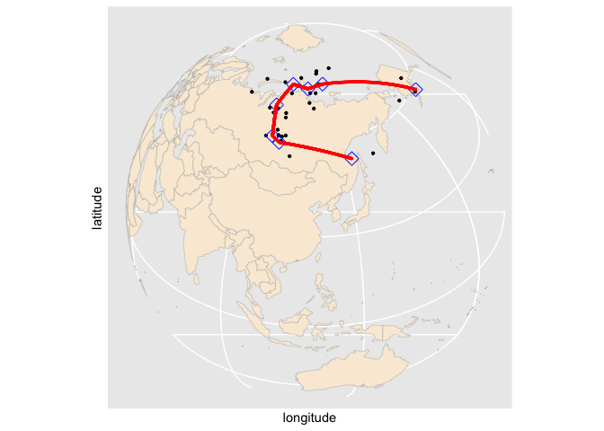
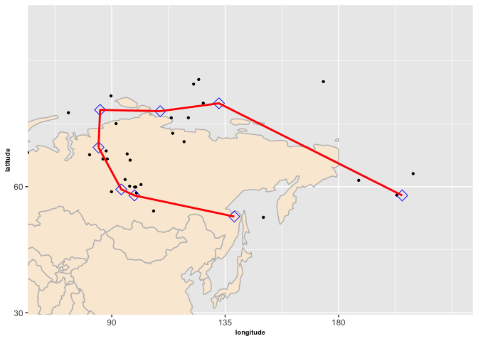

<!-- README.md is generated from README.Rmd. Please edit that file -->

# spheresmooth

This package offers a method of fitting a smooth path to a given set of
noisy spherical data observed at known time. It implements a piecewise
geodesic curve fitting method on the unit sphere based on a
velocity-based penalization scheme. The proposed approach is implemented
using the Riemannian block coordinate descent algorithm. To understand
the algorithm, you can refer to Bak, K. Y., Shin, J. K., & Koo, J. Y.
(2023)
[\<doi:10.1080/02664763.2022.2054962\>](https://www.tandfonline.com/doi/full/10.1080/02664763.2022.2054962)
for the case of order 1. Additionally, this package includes various
functions necessary for handling spherical data.

- Authorss:
  - Seyoung Lee, Sungshin Women’s University, <20210861@sungshin.ac.kr>
  - Kwan-Young Bak, professor at Sungshin Women’s University,
    <kybak@sungshin.ac.kr>,
    [ORCID:0000-0002-4541-160X](https://orcid.org/0000-0002-4541-160X%7D%7BORCID:0000-0002-4541-160X)

## Installation

You can install the development version of spheresmooth from
[GitHub](https://github.com/) with:

``` r
# install.packages("devtools")
devtools::install_github("kybak90/spheresmooth")
```

## Example: APW path fitting

A polar wander dataset presented in Kent and Irving (2010). The 17
Triassic/Jurassic cratonic poles from other major cratons are rotated
into North American coordinates and combined with the 14 observations
from North America. Our method is applied to these 31 observations
ranging in age from 243 to 144 Ma (millions of years ago), which covers
the late Triassic and Jurassic periods. The first column represents the
time points, and the remaining two columns provides the observed
spherical coordinates.

``` r
library(spheresmooth)
data(apw_spherical)
```

Convert the data to Cartesian coordinates.

``` r
apw_cartesian = Spherical_to_Cartesian(apw_spherical[, 2:3])
```

Generate a knot sequence along the time domain with a specified
dimension and a lambda sequence.

``` r
t = apw_spherical[, 1]
dimension = 15
initial_knots = knots_quantile(t, dimension = dimension)
lambda_seq = exp(seq(log(1e-07), log(1), length = 40))
```

Fit the penalized piecewise gedesic curve to the data and obtain the
control points for the optimal complexity parameter.

``` r
fit = penalized_linear_spherical_spline(t = t, y = apw_cartesian,
                                        dimension = dimension,
                                        initial_knots = initial_knots,
                                        lambdas = lambda_seq)
# choose a curve that minimizes the BIC
best_index = which.min(fit$bic_list)
best_index
#> [1] 33
# obtained control points for the piecewise geodesic curve
fit[[best_index]]$control_points
#>             [,1]       [,2]      [,3]
#> [1,] -0.48039447 -0.2266981 0.8472480
#> [2,] -0.11927705  0.1300343 0.9843089
#> [3,] -0.06869155  0.1967739 0.9780396
#> [4,]  0.01640654  0.2026538 0.9791130
#> [5,]  0.03231127  0.3512434 0.9357265
#> [6,] -0.03372888  0.5085848 0.8603510
#> [7,] -0.08310953  0.5246722 0.8472378
#> [8,] -0.45295783  0.3987197 0.7974032
```

The following packages are loaded to visualize the result.

``` r
# install.packages("rworldmap")
# install.packages("ggplot2")
library(rworldmap)
#> Loading required package: sp
#> ### Welcome to rworldmap ###
#> For a short introduction type :   vignette('rworldmap')
library(ggplot2)
```

Visualized the fitted result.

``` r
worldMap = getMap()
world.points = fortify(worldMap)
#> Regions defined for each Polygons
world.points$region = world.points$id
world.df = world.points[, c("long","lat","group", "region")]
colnames(world.df)[1] = "longitude"
colnames(world.df)[2] = "latitude"

cp_best = Cartesian_to_Spherical(fit[[best_index]]$control_points)
cp_long_lat = cp_best * 180 / pi
cp_long_lat_df = data.frame(latitude = 90-cp_long_lat[, 1],
                            longitude = cp_long_lat[,2])

apw_spherical_df = data.frame(apw_spherical)
colnames(apw_spherical_df) = c("time", "latitude", "longitude")
apw_spherical_df$latitude = 90 - apw_spherical_df$latitude * 180 / pi
apw_spherical_df$longitude = apw_spherical_df$longitude * 180 / pi

worldmap = ggplot() +
  geom_polygon(data = world.df, aes(x = longitude, y = latitude, group = group),colour = "grey", fill = "antiquewhite") +
  scale_y_continuous(breaks = (-2:2) * 30) +
  scale_x_continuous(breaks = (-4:4) * 45) +
  geom_point(data = apw_spherical_df, aes(x = longitude, y = latitude), cex = 0.8) +
  geom_point(data = cp_long_lat_df, aes(x = longitude, y = latitude), shape = 23, col = 'blue', cex = 4) +
  geom_line(data = cp_long_lat_df[1:5,], aes(x = longitude, y = latitude), col = 'red', lwd = 1) +
  geom_line(data = cp_long_lat_df[5:8,], aes(x = longitude, y = latitude), col = 'red', lwd = 1) +
  coord_map("ortho", orientation=c(38, 120, 0))
worldmap
```



We can obtain a zoomed version as follows.

``` r
mar = 20
zoommap = ggplot() +
  geom_polygon(data = world.df, aes(x = longitude, y = latitude, group = group),colour = "grey", fill = "antiquewhite") +
  scale_y_continuous(breaks = (-2:2) * 30) +
  scale_x_continuous(breaks = (-4:4) * 45) +
  geom_point(data = apw_spherical_df, aes(x = longitude, y = latitude), cex = 0.8) +
  geom_point(data = cp_long_lat_df, aes(x = longitude, y = latitude), shape = 23, col = 'blue', cex = 4) +
  geom_line(data = cp_long_lat_df[1:5,], aes(x = longitude, y = latitude), col = 'red', lwd = 1) +
  geom_line(data = cp_long_lat_df[5:8,], aes(x = longitude, y = latitude), col = 'red', lwd = 1) +
  coord_cartesian(xlim = c(min(cp_long_lat_df$longitude) - mar, max(cp_long_lat_df$longitude) + mar),
                  ylim = c(min(cp_long_lat_df$latitude) - mar, max(cp_long_lat_df$latitude) + mar)) +
  xlab('longitude') + ylab('latitude') +
  theme(axis.title=element_text(size = 7,face="bold"))
zoommap
```


